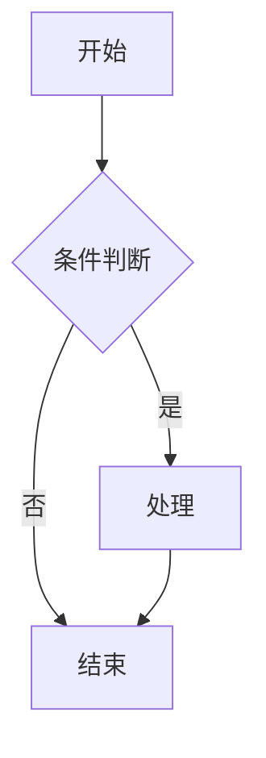
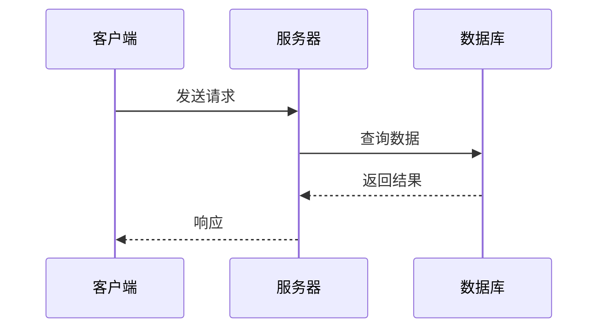

# Graphite 完整语法示例

这个文件演示了 Graphite 编辑器支持的所有语法功能。

---

## 1\. 标题

# 标题 1 (H1)

## 标题 2 (H2)

### 标题 3 (H3)

#### 标题 4 (H4)

##### 标题 5 (H5)

###### 标题 6 (H6)

---

## 2\. 文本格式

**粗体文本**

*斜体文本*

***粗斜体***

~~删除线~~

下划线

==高亮== 文本

普通文本 `行内代码`

---

## 3\. 列表

### 无序列表

- 项目 A
 
- 项目 B
 
 - 子项目 B1
 
 - 子项目 B2
 
- 项目 C
 

### 有序列表

1. 第一步
 
2. 第二步
 
3. 第三步
 

### 任务列表

- 已完成任务
 
- 未完成任务
 
- 另一个待办
 
 - 嵌套已完成
 
 - 嵌套待办
 

---

## 4\. 链接与图片

这是一个链接：[Graphite](https://github.com)


---

## 5\. 引用

> 这是一段引用文本。
> 
> 引用可以跨多行。
> 
> > 引用可以嵌套。

---

## 6\. 代码

行内代码：`const x = 42`

代码块（带语法高亮）：

```javascript
function hello(name) {
 console.log(`Hello, ${name}!`)
 return 42
}
```

```python
def fibonacci(n):
 a, b = 0, 1
 for _ in range(n):
 yield a
 a, b = b, a + b
```

```rust
fn main() {
 println!("Hello, world!");
 let v = vec![1, 2, 3];
 v.iter().map(|x| x * 2).collect::<Vec<_>>();
}
```

---

## 7\. 表格

| | | |
| :--- | :---: | ---: |
| ◇BLANK◇ | ◇BLANK◇ | ◇BLANK◇ |
| ◇BLANK◇ | ◇BLANK◇ | ◇BLANK◇ |
| ◇BLANK◇ | ◇BLANK◇ | ◇BLANK◇ |
| ◇BLANK◇ | ◇BLANK◇ | ◇BLANK◇ |
| ◇BLANK◇ | ◇BLANK◇ | ◇BLANK◇ |
| ◇BLANK◇ | ◇BLANK◇ | ◇BLANK◇ |
| ◇BLANK◇ | ◇BLANK◇ | ◇BLANK◇ |
| ◇BLANK◇ | ◇BLANK◇ | ◇BLANK◇ |
| ◇BLANK◇ | ◇BLANK◇ | ◇BLANK◇ |
| ◇BLANK◇ | ◇BLANK◇ | ◇BLANK◇ |
| ◇BLANK◇ | ◇BLANK◇ | ◇BLANK◇ |
| ◇BLANK◇ | ◇BLANK◇ | ◇BLANK◇ |
| ◇BLANK◇ | ◇BLANK◇ | ◇BLANK◇ |
| 左对齐 | 居中对齐 | 右对齐 |
| 苹果 | 香蕉 | 樱桃 |
| 日期 | 葡萄 | 荔枝 |
| 芒果 | 橙子 | 桃子 |

| | | |
| --- | --- | --- |
| ◇BLANK◇ | ◇BLANK◇ | ◇BLANK◇ |
| ◇BLANK◇ | ◇BLANK◇ | ◇BLANK◇ |
| ◇BLANK◇ | ◇BLANK◇ | ◇BLANK◇ |
| ◇BLANK◇ | ◇BLANK◇ | ◇BLANK◇ |
| ◇BLANK◇ | ◇BLANK◇ | ◇BLANK◇ |
| ◇BLANK◇ | ◇BLANK◇ | ◇BLANK◇ |
| ◇BLANK◇ | ◇BLANK◇ | ◇BLANK◇ |
| ◇BLANK◇ | ◇BLANK◇ | ◇BLANK◇ |
| ◇BLANK◇ | ◇BLANK◇ | ◇BLANK◇ |
| ◇BLANK◇ | ◇BLANK◇ | ◇BLANK◇ |
| ◇BLANK◇ | ◇BLANK◇ | ◇BLANK◇ |
| ◇BLANK◇ | ◇BLANK◇ | ◇BLANK◇ |
| ◇BLANK◇ | ◇BLANK◇ | ◇BLANK◇ |
| 名称 | 类型 | 说明 |
| `id` | `int` | 主键 |
| `name` | `text` | 名称 |
| `created_at` | `timestamp` | 创建时间 |

---

## 8\. 数学公式

### 行内公式

爱因斯坦的 $$ 是著名的质能方程。

勾股定理：$$

### 块级公式

---

## 9\. Mermaid 流程图



### 时序图



### 甘特图

```mermaid
gantt
 title 项目计划
 dateFormat YYYY-MM-DD
 section 阶段一
 需求分析 :done, 2024-01-01, 7d
 设计 :active, 2024-01-08, 5d
 section 阶段二
 开发 :2024-01-15, 14d
 测试 :2024-01-29, 7d
<dl><dt>```

---

## 10. 定义列表

Markdown</dt><dd>一种轻量级标记语言</dd></dl>

<dl><dt>HTML</dt><dd>超文本标记语言</dd></dl>
<dl><dt>: 用于构建网页

<dl><dt>CSS</dt><dd>层叠样式表</dd></dl></dt><dd>控制网页的样式和布局</dd></dl>

---

## 11. 脚注

这是一段需要注解的文本[^1]。

这里还有一个引用[^2]。

<sup data-footnote="1">[1]: 这是第一条脚注的内容。</sup>
 脚注支持多行内容。
<sup data-footnote="2">[2]: 第二条脚注。</sup>

---

## 12. 文本对齐

### 左对齐

普通段落默认左对齐。

### 居中对齐

使用工具栏的居中对齐按钮。

### 右对齐

使用工具栏的右对齐按钮。

---

## 13. 分割线

上面有一条分割线。

---

## 14. 组合示例

> ### 引用内的标题
>
> 引用内可以包含 **各种格式** 和 `代码`。
>
> ```json
> { "key": "value" }
> ```
>
> - 引用内的列表项
> - 另一个列表项

| 功能 | 状态 | 备注 |
| ---- | :--: | ---- |
| 标题 | ✅ | H1-H6 |
| 格式 | ✅ | 粗体、斜体、删除线、下划线、高亮 |
| 列表 | ✅ | 有序、无序、任务列表 |
| 表格 | ✅ | 支持对齐 |
| 代码 | ✅ | 行内、代码块、语法高亮 |
| 数学 | ✅ | KaTeX 行内和块级 |
| 图表 | ✅ | Mermaid 流程图、时序图、甘特图 |
| 脚注 | ✅ | 支持多行 |
| 定义 | ✅ | 定义列表 |
| 图片 | ✅ | 本地图片插入 |

---

*Graphite — WYSIWYG Markdown Editor*
```

 ◇BLANK◇