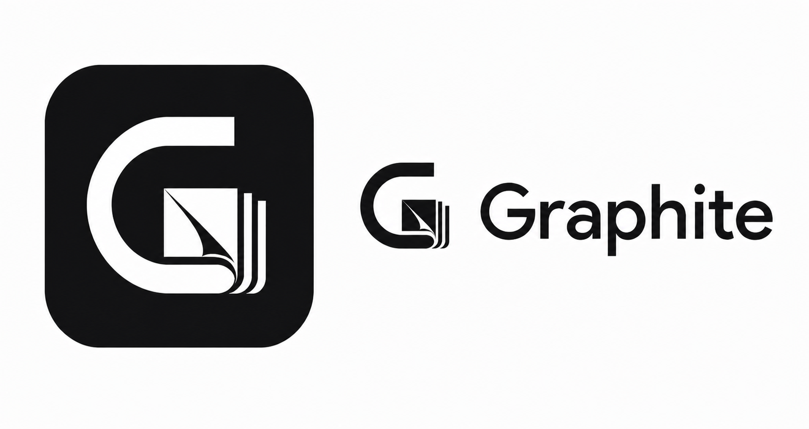

# Graphite

WYSIWYG Markdown 编辑器，基于 Tauri 2 + React 18 + TypeScript + Rust。



## 功能

### 编辑

- 所见即所得编辑，Markdown 语法实时渲染
- **粗体**、*斜体*、***粗斜体***、~~删除线~~、<u>下划线</u>、==高亮==、`行内代码`
- 标题 H1-H6、引用、有序/无序列表、任务列表
- 表格、代码块（语法高亮）、分割线
- 定义列表、脚注（双向跳转）
- **Mermaid 图表**（流程图、时序图、饼图、甘特图等）
- 链接点击通过 Tauri 打开、图片拖入/粘贴插入
- 锚点跳转（`#标题` 链接跳转到对应位置）

### 界面

- 文件树浏览、大纲面板、搜索替换
- 命令面板（Ctrl+Shift+P）
- 斜杠命令菜单（`/` 触发）
- 暗黑模式、5 种主题变体
- Ctrl+滚轮缩放字体

### 导出

- HTML / PDF / PNG 导出
- **跨平台支持**（Windows / macOS / Linux）
- 自动检测系统浏览器（Chrome / Edge / Chromium / Brave）
- 无浏览器时自动下载 Chromium

### 其他

- 自动保存（可配置延迟）
- 快捷键自定义
- 会话恢复（光标位置、滚动位置）
- 文件系统监控（外部修改自动提示）

## 构建

### 前置要求

- [Node.js](https://nodejs.org/) 18+
- [Rust](https://rustup.rs/)
- [Visual Studio Build Tools](https://visualstudio.microsoft.com/visual-cpp-build-tools/)（Windows）

### 开发

```bash
# 安装依赖
npm install

# 启动开发模式
npm run tauri dev
```

### 构建安装包

```bash
# 下载 Chromium（用于 PDF/PNG 导出，可选）
powershell -ExecutionPolicy Bypass -File scripts/download-chromium.ps1

# 构建
npm run tauri build
```

> 如果系统已安装 Chrome / Edge / Chromium，可跳过下载 Chromium 步骤。

## 语法速查

| 输入 | 结果 |
|------|------|
| `**粗体**` | **粗体** |
| `*斜体*` | *斜体* |
| `***粗斜体***` | ***粗斜体*** |
| `~~删除线~~` | ~~删除线~~ |
| `++下划线++` | <u>下划线</u> |
| `==高亮==` | ==高亮== |
| `` `代码` `` | `代码` |
| `[文字](链接)` | 链接 |
| `# 标题` | 标题 1 |
| `> 引用` | 引用块 |
| `- 列表` | 无序列表 |
| `1. 列表` | 有序列表 |
| `- [x] 任务` | 任务列表 |
| ` ```代码块``` ` | 代码块 |
| `---` | 分割线 |
| `术语` + Enter + `: 定义` | 定义列表 |
| `[^1]` + Enter | 脚注引用 |
| `[^1]:` + Enter | 脚注定义 |
| ` ```mermaid ` + 图表代码 | Mermaid 图表 |

## 技术栈

- **前端**: React 18, TypeScript, TipTap v3 / ProseMirror, Tailwind CSS, Zustand
- **后端**: Tauri 2, Rust, chromiumoxide（PDF/PNG 导出）
- **渲染**: marked（Markdown）, turndown（HTML → Markdown）, mermaid（图表）
- **构建**: Vite, Cargo

## 许可

MIT
